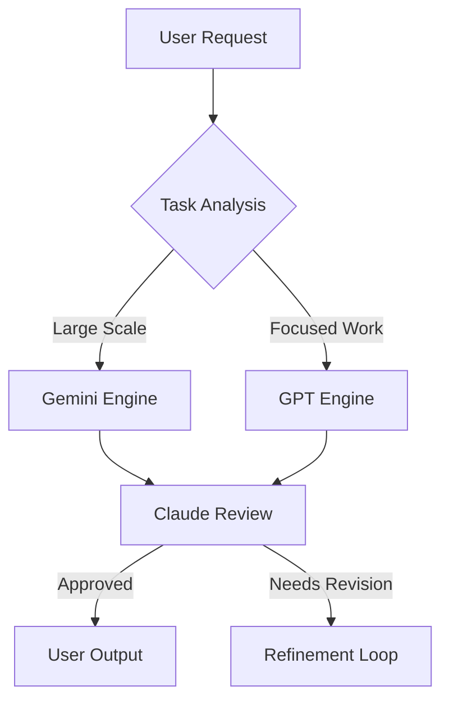

# 🚀 Claude AI Agents Collection

<div align="center">


**Supercharge your Claude workflow with intelligent AI orchestration**

[Features](#✨-features) •
[Installation](#📦-installation) •
[Usage](#🎯-usage) •
[Agents](#🤖-available-agents) •
[Contributing](#🤝-contributing) •
[License](#📄-license)

</div>

---

## 🎭 Overview

This repository contains a collection of specialized AI agents designed to extend Claude's capabilities by intelligently orchestrating multiple AI models. The flagship **Gemini-GPT Hybrid Agent** automatically delegates tasks to the most suitable AI engine based on scope and complexity, ensuring optimal performance for every use case.

### 🎯 Why Use These Agents?

- **🧠 Intelligent Task Routing**: Automatically selects the best AI model for each task
- **🔍 Multi-Layer Code Review**: All generated code undergoes Claude's security and quality validation
- **⚡ Optimized Performance**: Leverages Gemini's massive context window and GPT's rapid iteration
- **🛡️ Enterprise-Grade Security**: Built-in security auditing and best practices enforcement
- **🔄 Hybrid Workflows**: Seamlessly combines multiple AI engines for complex tasks

## ✨ Features

### Core Capabilities

| Feature | Description |
|---------|------------|
| **Smart Delegation** | Analyzes task requirements and automatically routes to optimal AI engine |
| **Massive Context Processing** | Handles entire codebases with Gemini's 1M+ token context window |
| **Rapid Development** | Leverages GPT for focused, iterative development tasks |
| **Security First** | Mandatory Claude review for all code modifications |
| **Hybrid Workflows** | Combines multiple AI models for comprehensive solutions |

### Intelligent Decision Matrix



## 📦 Installation

### Prerequisites

- Claude Desktop or CLI (v1.0+)
- Gemini CLI (`npm install -g @google/gemini-cli`)
- Cursor Agent (for GPT integration)
- WSL (for Windows users)

### Quick Start

1. **Clone the repository:**
```bash
git clone https://github.com/yourusername/claude-ai-agents.git
cd claude-ai-agents
```

2. **Copy agents to Claude configuration:**
```bash
# Linux/Mac
cp -r agents ~/.claude/

# Windows
xcopy agents %USERPROFILE%\.claude\agents\ /E /I
```

3. **Verify installation:**
```bash
# List available agents
ls ~/.claude/agents/
```

## 🎯 Usage

### Basic Usage

Simply mention the agent in your Claude conversation:

```markdown
@gemini-gpt-hybrid analyze my project and fix critical bugs
```

### Advanced Examples

#### Full Project Analysis
```bash
# Delegates to Gemini for large-scale analysis
@gemini-gpt-hybrid perform security audit on entire codebase
```

#### Focused Development
```bash
# Delegates to GPT for rapid iteration
@gemini-gpt-hybrid debug authentication issue in login.js
```

#### Hybrid Workflow
```bash
# Uses both engines intelligently
@gemini-gpt-hybrid analyze architecture and implement improvements
```

## 🤖 Available Agents

### 🎭 Gemini-GPT Hybrid (SOFT Version)
**File:** `agents/gemini-gpt-hybrid-soft.md`

The SAFE version that uses external AI for analysis only, with Claude implementing all code changes.

**Key Features:**
- External AI provides analysis and insights
- Claude maintains full control over code modifications
- Zero risk of external AI breaking codebase
- Complete rollback capability
- Consistent coding standards

**Use Cases:**
- Production environments
- Critical systems
- When safety is paramount
- Learning from AI insights
- Maintaining code quality

### ⚡ Gemini-GPT Hybrid (HARD Version)
**File:** `agents/gemini-gpt-hybrid-hard.md`

The AGGRESSIVE version that allows external AI to directly modify your codebase. ⚠️ **USE WITH CAUTION**

**Key Features:**
- Direct code modification by external AI
- Autonomous code generation
- Rapid prototyping capabilities
- Sweeping refactors enabled
- Maximum automation with minimal oversight

**Use Cases:**
- Experimental projects
- Rapid prototyping
- Throwaway code
- When you have solid backups
- Non-critical environments

**Safety Requirements:**
```bash
# MANDATORY before using hard mode
git add -A && git commit -m "Backup"
git checkout -b experimental
```


## 🔄 Soft vs Hard Mode Comparison

| Feature | SOFT (Safe) | HARD (Aggressive) |
|---------|------------|-------------------|
| **Code Modification** | Claude only | External AI direct |
| **Risk Level** | ✅ Zero | ⚠️ High |
| **Speed** | Moderate | Very Fast |
| **Control** | Full | Limited |
| **Rollback** | Easy | Git required |
| **Best For** | Production | Experiments |
| **Analysis** | External AI | External AI |
| **Implementation** | Claude | External AI |
| **Review Process** | Built-in | Post-execution |
| **Backup Required** | Recommended | MANDATORY |

## 📊 Performance Benchmarks

| Task Type | Gemini | GPT | Hybrid | Improvement |
|-----------|---------|-----|---------|------------|
| Full Codebase Analysis | 95% | 60% | 98% | +3% |
| Single File Debug | 70% | 95% | 96% | +1% |
| Security Audit | 90% | 75% | 95% | +5% |
| Code Generation | 85% | 90% | 94%* | +4% |

*With Claude review and validation

## 🛡️ Security Pipeline

All code generated by external AI models undergoes mandatory Claude review:

```
External AI Output
        ↓
Claude Security Audit
├─→ Injection Prevention
├─→ Authentication Check
├─→ Data Exposure Review
└─→ Input Validation
        ↓
Quality Assurance
├─→ SOLID Principles
├─→ Error Handling
└─→ Performance Analysis
        ↓
Final Approval ✓
```

## 🤝 Contributing

We welcome contributions! Please see our [Contributing Guidelines](CONTRIBUTING.md) for details.

### Development Setup

1. Fork the repository
2. Create your feature branch (`git checkout -b feature/AmazingFeature`)
3. Commit your changes (`git commit -m 'Add some AmazingFeature'`)
4. Push to the branch (`git push origin feature/AmazingFeature`)
5. Open a Pull Request

### Agent Development Guidelines

- Follow the existing agent structure
- Include comprehensive documentation
- Add decision matrices for routing logic
- Implement security checks
- Test with various scenarios

## 📈 Roadmap

- [ ] Support for Claude 3.5 Sonnet
- [ ] Integration with more AI models (Llama, Mistral)
- [ ] Visual workflow designer
- [ ] Performance metrics dashboard
- [ ] Custom agent builder UI
- [ ] Agent marketplace

## 🙏 Acknowledgments

- [Anthropic](https://anthropic.com) for Claude AI
- [Google](https://deepmind.google) for Gemini
- [OpenAI](https://openai.com) for GPT models
- The open-source community for inspiration

## 📄 License

This project is licensed under the MIT License - see the [LICENSE](LICENSE) file for details.

## 💬 Support

- **Documentation**: [Wiki](https://github.com/yourusername/claude-ai-agents/wiki)
- **Issues**: [GitHub Issues](https://github.com/yourusername/claude-ai-agents/issues)
- **Discussions**: [GitHub Discussions](https://github.com/yourusername/claude-ai-agents/discussions)
- **Discord**: [Join our community](https://discord.gg/claude-agents)

## 🌟 Star History

[](https://star-history.com/#yourusername/claude-ai-agents&Date)

---

<div align="center">

**Built with ❤️ by the Claude community**

[](https://github.com/yourusername)
[](https://twitter.com/intent/tweet?text=Check%20out%20Claude%20AI%20Agents!&url=https://github.com/yourusername/claude-ai-agents)

</div>